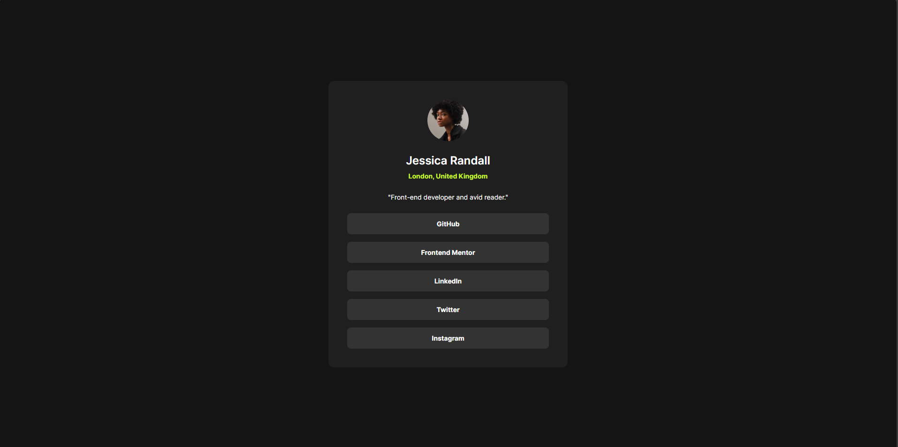

The README file has been updated to reflect the new font import in your `index.css`. Here is the revised version:

---

# Frontend Mentor - Social links profile solution

This is a solution to the [Social links profile challenge on Frontend Mentor](https://www.frontendmentor.io/challenges/social-links-profile-UG32l9m6dQ). Frontend Mentor challenges help you improve your coding skills by building realistic projects.

## Table of contents

- [Overview](#overview)
  - [The challenge](#the-challenge)
  - [Screenshot](#screenshot)
  - [Links](#links)
- [My process](#my-process)
  - [Built with](#built-with)
  - [What I learned](#what-i-learned)
  - [Continued development](#continued-development)
  - [Useful resources](#useful-resources)
- [Author](#author)
- [Acknowledgments](#acknowledgments)

## Overview

### The challenge

The challenge was to build a static profile card page that includes:

- A user avatar
- Main information such as the user's name and location
- A short bio
- Links to the user's social profiles

The design needed to be fully responsive and accessible on various screen sizes.

### Screenshot

### Links

- Solution URL: [Repository](https://github.com/bastianrecr/social-links-profile-fm)
- Live Site URL: [GitHub Pages](https://bastianrecr.github.io/social-links-profile-fm/)

## My process

### Built with

- Semantic HTML5 markup
- CSS for styling and layout
- [BEM](https://getbem.com/) methodology for class naming
- CSS modularization for better maintainability
- Normalize.css for consistent styling across browsers
- Media queries for a responsive design

### What I learned

This project allowed me to:

- Improve my understanding of BEM and how it simplifies CSS organization
- Practice creating responsive designs using media queries
- Gain experience in importing and utilizing custom web fonts
- Work on structuring reusable blocks for better scalability

### Continued development

I want to continue focusing on:

- Enhancing the accessibility of my projects by ensuring ARIA roles are properly applied
- Experimenting with advanced layout techniques using CSS Grid and Flexbox
- Improving the responsiveness of my designs, especially for larger screens

### Useful resources

- [BEM Documentation](https://getbem.com/) - Helped me organize my CSS effectively.
- [MDN Web Docs](https://developer.mozilla.org/) - Provided excellent references for HTML and CSS.
- [Normalize.css](https://necolas.github.io/normalize.css/) - Ensured consistent styling across browsers.

## Author

- Frontend Mentor - [@bastianrecr](https://www.frontendmentor.io/profile/bastianrecr)
- LinkedIn - [Sebastian Regules](www.linkedin.com/in/sebastian-regules-763b5624b)

## Acknowledgments

Special thanks to Frontend Mentor for providing challenging and fun projects that help improve coding skills. This challenge was a great opportunity to refine my CSS, responsive design techniques, and font integration strategies.
